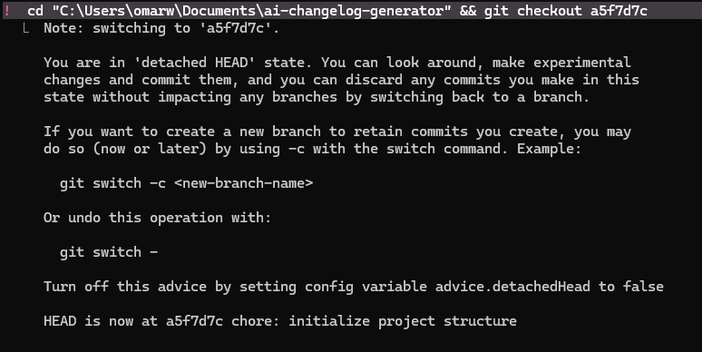

# AI Changelog Generator

> Turn your git commits into beautiful, human-readable release notes — automatically.

[](LICENSE)

## Quick Start

```bash
npx ai-changelog          # run in any git repo
npx ai-changelog /path/to/repo
```

---

## Grading Checklist (SE Course: Prof. Edlich)

### 1. Git
Branch strategy, merges, and time-travel demonstrated in this repository.
- See commit history: [github.com/OmarADev/ai-changelog-generator/commits](https://github.com/OmarADev/ai-changelog-generator/commits)
- Feature branch merged: `feature/cli-core` → `main`
- Time-travel example: `git checkout <hash>` shown in screenshots (see `docs/git-screenshots/`)


This project uses Conventional Commits (`feat:`, `fix:`, `docs:`, etc.) — the same format our tool reads to generate changelogs.

### 2. Requirements

**a) Simple tool (Airtable):** [Airtable board](https://airtable.com/appywvnxpKDPCBdtP/tblvLl79AsGOfqzuM/viwh8sGsrPOlQJyxW) — 8 requirements with priority, MoSCoW, status, and iteration attributes. [Screenshot](docs/requirements-screenshots/airtable-requirements-board.png)

**b) Professional tool (Jira):** [Jira board](https://omar2942004.atlassian.net/jira/software/c/projects/ACG/boards/3/backlog) — same requirements with additional fields: acceptance criteria, story points, assignee, sprint. Screenshots: [Board view](docs/requirements-screenshots/jira-board-all-requirements.png) | [Issue detail](docs/requirements-screenshots/jira-issue-detail-cli-tool.png)

**AI usage note:** Claude was used to help draft requirement descriptions. Final requirements, priorities, and acceptance criteria were defined by the author.

**c) Constitution + Spec/Validation docs:**
- [Mission](docs/mission.md)
- [Roadmap](docs/roadmap.md)
- [Tech Stack](docs/techstack.md)
- [Constitution](docs/constitution.md)
- [Iteration 1: Spec](docs/iteration-1-spec.md)
- [Iteration 1: Validation](docs/iteration-1-validation.md)
- [Iteration 2: Spec](docs/iteration-2-spec.md)

Full requirements list: [requirements/requirements.md](requirements/requirements.md)

### 3. Analysis
- [Startup Analysis (Classic + AI)](docs/startup-analysis.md) — 15 points covering problem, market, competition, business model, AI strategy, ethics

### 4. UML
Diagrams exported as PNG in `docs/uml/`. Drawn manually in draw.io — no AI used for diagram content.
- [Use-Case Diagram](docs/uml/use-case-diagram.png) — 18 use cases: Developer actor (sign in, connect repo, generate changelog, configure settings, export, run CLI, upgrade to Pro, remove branding, set custom domain) and End User actor (view public page, browse versions, read release, subscribe), with GitHub / Claude AI API / Lemon Squeezy as external system actors
- [Class Diagram](docs/uml/class-diagram.png) — 6 classes: CLIRunner, ChangelogGenerator, Commit, ChangelogEntry, User, Repository
- [Component Diagram](docs/uml/component-diagram.png) — 3 layers: Presentation (CLIInterface), Application (GitReader, ChangelogGenerator), External (Git Repository, stdout)
- [Activity Diagram](docs/uml/activity%20diagram.png) — CLI execution flow: validate path → read git log → parse → categorize → format → output

### 5. DDD
Diagrams exported as PNG in `docs/ddd/`. Drawn manually in draw.io.

- [Event Storming: Events](docs/ddd/event%20storming%201%20events.png) — 20 domain events across 5 bounded contexts (Authentication, Repository, Changelog, Billing, Notification)
- [Event Storming: Commands](docs/ddd/event%20storming%202%20commands.png) — 21 commands mapped to their triggering events
- [Core Domain Chart](docs/ddd/core%20domain%20chart.png) — Strategic classification: Changelog (Core), Repository (Supporting), Auth/Billing/Notification (Generic)
- [Context Mapping](docs/ddd/context%20mapping.png) — 5 bounded contexts with Customer/Supplier and Conformist integration patterns, upstream/downstream notation on every relationship
- [Bounded Context Canvas](docs/ddd/bounded%20context%20canvas.png) — Deep dive on the Changelog core domain: purpose, roles, inbound/outbound communications, ubiquitous language, business decisions, assumptions

### 6. Clean Code Development
Five annotated examples from the real source code, each tied to a named clean code principle:

1. Single Responsibility: `categorizeCommit()` has exactly one reason to change
2. Meaningful Names: every variable in `generateChangelog()` describes what it holds
3. Pure Functions: `formatCommitLine()` depends only on its input, touches nothing else
4. Fail Fast: `index.ts` exits immediately on invalid input with a clear error message
5. Small Functions: every function in `generator.ts` is under 20 lines

Full annotations: [docs/clean-code.md](docs/clean-code.md)

Personal CCD cheat sheet (12 principles): [docs/ccd-cheatsheet.md](docs/ccd-cheatsheet.md) | [PDF](docs/ccd-cheatsheet.pdf)

### 7. Refactoring
Two non-trivial before/after examples from the real source code:

1. **Extract Function:** `generateChangelog` originally mixed categorization, grouping, and formatting in one 25-line block. Extracted `categorizeCommit()` and `formatCommitLine()` as separate pure functions. This is what made the unit tests in section 8 possible.
2. **Error handling at the boundary:** `index.ts` originally had no error handling, dumping raw Node.js stack traces on invalid paths. Refactored to a top-level try/catch with a human-readable message and proper exit codes.

Full before/after code and failure notes: [docs/refactoring.md](docs/refactoring.md)

### 8. Testing
Unit tests in [`src/__tests__/generator.test.ts`](src/__tests__/generator.test.ts) covering the core `generateChangelog()` function.

**Part A: without AI** — written manually, no mocks, basic assertions:
- Groups `feat:` commits under "Features"
- Groups `fix:` commits under "Bug Fixes"
- Routes unrecognized commits to "Other Changes"
- Handles empty input

All 4 tests pass. See: [tests-passing.png](docs/screenshots/tests-passing.png)

**Part B: with AI + mocks** — `execSync` from `child_process` mocked via `jest.mock`. Three tests covering the CLI entry point (`index.ts`):
- Prints changelog when git log returns commits
- Prints "No commits found." and exits 0 for an empty repository
- Prints error message and exits 1 when path is not a git repository

All 7 tests pass (4 Part A + 3 Part B).

### 9. Build Management
npm scripts defined in `package.json`:

| Script | Command | Purpose |
|--------|---------|---------|
| `build` | `tsc` | Compile TypeScript to `dist/` |
| `test` | `jest` | Run unit tests |
| `lint` | `eslint src/**/*.ts` | Static analysis |
| `docs` | `typedoc --entryPoints src/index.ts --out docs/api` | Generate API docs |

ESLint configured in `.eslintrc.json` with `@typescript-eslint` rules.
See CI pipeline screenshot: [ci-pipeline-steps.png](docs/screenshots/ci-pipeline-steps.png)

**Where I failed:** Running `npm run lint` locally on Windows produced no output and no errors, which looked like success but was actually a silent failure. The glob pattern `src/**/*.ts` in `package.json` is not shell-expanded by PowerShell before being passed to ESLint, so ESLint received the literal string and matched zero files. I caught this when the lint step flagged nothing despite a known issue in the code. Running `npx eslint src/index.ts src/generator.ts` directly confirmed the linter was working correctly. The CI pipeline on Linux (GitHub Actions) expands the glob as expected, so `npm run lint` works there — this was a local tooling environment mismatch, not a code problem.

### 10. Continuous Delivery
GitHub Actions pipeline defined in [`.github/workflows/ci.yml`](.github/workflows/ci.yml). Runs on every push and pull request to `main`.

Pipeline steps:
1. Install dependencies (`npm install`)
2. Lint (`npm run lint`)
3. Test (`npm test`)
4. Build (`npm run build`)

First run passed on Jun 3, 2026 in 1m 17s.
- [Pipeline overview](docs/screenshots/ci-pipeline-overview.png)
- [Pipeline steps: all passing](docs/screenshots/ci-pipeline-steps.png)

### 11. Metrics
Two code quality metrics documented with screenshots and analysis:

1. **Jest Test Coverage** — 96.36% statement coverage, 100% function coverage, 11 tests across 2 suites
2. **SonarCloud Static Analysis** — Security A, Reliability A, Maintainability A (3 minor code smells), 0 bugs, 0 vulnerabilities

Full breakdown with screenshots and explanation of findings: [docs/metrics.md](docs/metrics.md)

### 12. Architecture
arc42 Architecture Communication Canvas covering system context, building block breakdown (CLI and planned web layer), runtime flows for both CLI and web changelog generation, deployment view (npm + Vercel + Supabase), five key architecture decision records (TypeScript strict mode, Next.js vs Express+React, Claude vs GPT-4, Supabase over self-hosted, Lemon Squeezy over Stripe), quality goals, and known risks/technical debt.

Full canvas: [docs/architecture/arc42-canvas.md](docs/architecture/arc42-canvas.md)

### 13. Vibe Coding / Agentic Coding (counts double)
*Planned — three parts: (A) GUI built with Google Stitch, prompts documented in GitHub; (B) middle-sized pet project via Lovable; (C) distributed app built step-by-step with Claude Code, separate modules, md files per step, with full proof of understanding.*

---

## Project Structure

```
├── .github/
│   └── workflows/
│       └── ci.yml              # GitHub Actions CI pipeline
├── src/
│   ├── __tests__/
│   │   └── generator.test.ts   # Unit tests
│   ├── index.ts                # CLI entry point
│   └── generator.ts            # Core changelog generation logic
├── docs/
│   ├── screenshots/
│   │   ├── ci-pipeline-overview.png
│   │   ├── ci-pipeline-steps.png
│   │   └── tests-passing.png
│   ├── requirements-screenshots/
│   │   ├── airtable-requirements-board.png
│   │   ├── jira-board-all-requirements.png
│   │   └── jira-issue-detail-cli-tool.png
│   ├── mission.md
│   ├── roadmap.md
│   ├── techstack.md
│   ├── constitution.md
│   ├── iteration-1-spec.md
│   ├── iteration-1-validation.md
│   ├── iteration-2-spec.md
│   └── startup-analysis.md
├── requirements/
│   └── requirements.md
├── .eslintrc.json
├── package.json
└── tsconfig.json
```

## Tech Stack

- TypeScript / Node.js (CLI)
- Next.js (Web dashboard — Iteration 2)
- Claude AI API (Iteration 2)
- GitHub OAuth / NextAuth (Iteration 2)
- Lemon Squeezy (Payments — Iteration 2)
- Vercel (Deployment)
