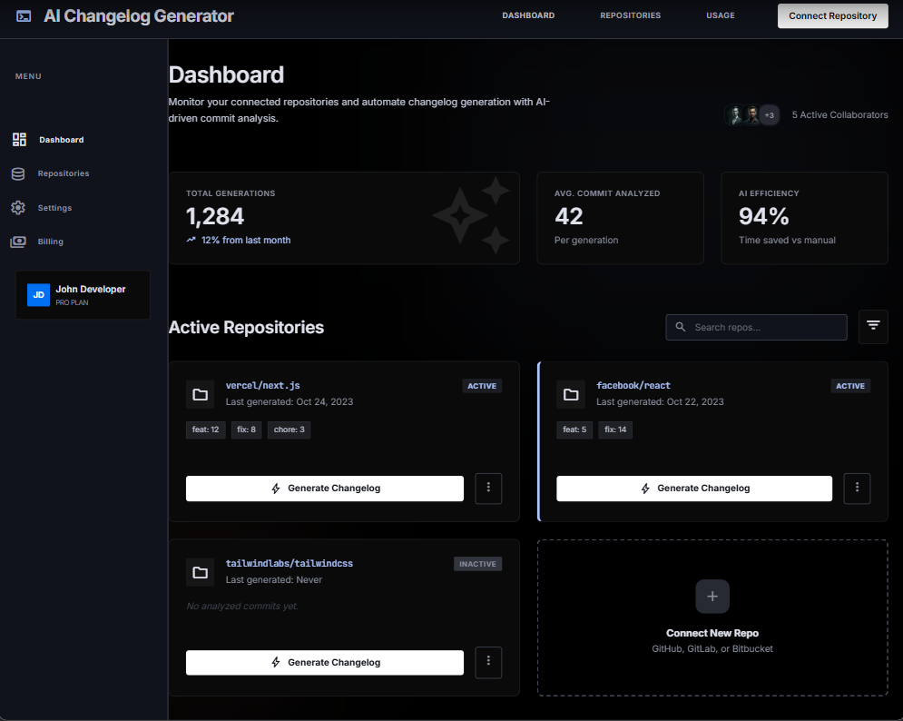
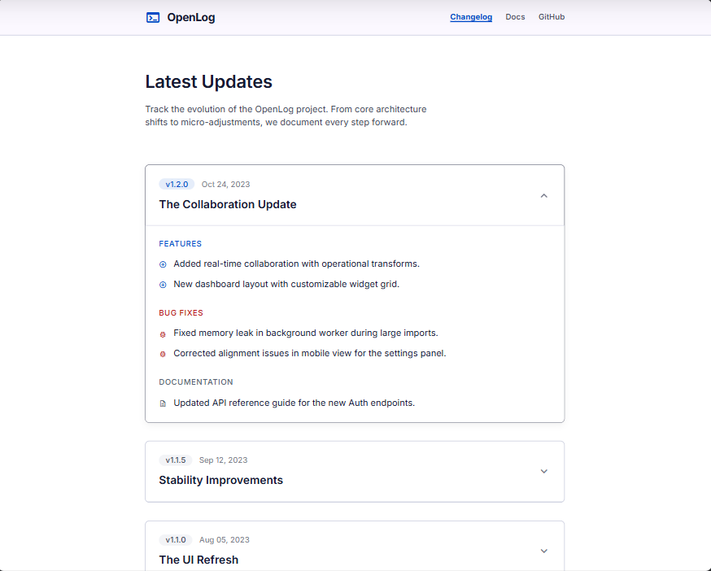

# 13A — Vibe Coding: GUI Design with Google Stitch

**Tool:** Google Stitch (stitch.withgoogle.com)
**Author:** Omar Abdelaziz
**Date:** 2026-06-14
**Task:** Design the two core UI screens of the AI Changelog Generator using natural language prompts only — no Figma, no manual wireframing.

---

## Prompt 1 — Developer Dashboard

**Prompt pasted into Stitch:**

> Design a clean, modern dashboard for a developer tool called "AI Changelog Generator".
> The dashboard should show:
> A header with the product name and a "Connect Repository" button
> A list of connected GitHub repositories as cards, each showing repo name, last generated date, and a "Generate Changelog" button
> A sidebar with navigation: Dashboard, Repositories, Settings, Billing
> Dark theme, minimalist, similar to Vercel or Linear's design aesthetic
> Use a monospace font for repo names and code-related text

**Generated design:**

**What Stitch generated:** A dark-theme dashboard with a persistent left sidebar (Dashboard, Repositories, Settings, Billing navigation + user profile at the bottom), a top navigation bar with product name and "Connect Repository" CTA, a stats row showing Total Generations (1,284), Avg. Commit Analyzed (42), and AI Efficiency (94%), and a grid of repository cards. Each card shows the repo name, last generated date, commit type tags (feat, fix, chore), an active/inactive status badge, and a "Generate Changelog" button. A "Connect New Repo" dashed card was added as a bonus affordance.

**What I asked for vs what I got:** Stitch added the stats row and the active/inactive status badges without being prompted — both are genuinely useful product features. The monospace font on repo names was applied correctly. The overall visual language matches the Vercel/Linear reference exactly: dark background, subtle card borders, tight typography.

---

## Prompt 2 — Public Changelog Page

**Prompt pasted into Stitch:**

> Design a public-facing changelog page for an open source project.
> The page should show:
> Project name and logo at the top
> A "Powered by AI Changelog Generator" badge in the footer, small and unobtrusive
> A chronological list of release entries, each with a version number, date, and categorized sections: Features, Bug Fixes, Documentation
> Each entry should be expandable/collapsible
> Clean typography, generous white space, similar to Stripe's changelog page
> Light theme, professional, suitable for a public audience

**Generated design:**

**What Stitch generated:** A light-theme public page with a top navigation bar (Changelog, Docs, GitHub links), a "Latest Updates" hero heading with a subtitle, and a chronological list of versioned release entries. Each entry shows a version badge (v1.2.0, v1.1.5, v1.1.0), a release date, a release name ("The Collaboration Update"), and an expand/collapse chevron. The expanded entry shows categorized sections — FEATURES, BUG FIXES, DOCUMENTATION — each with icon-prefixed line items. Older entries are collapsed by default, showing only the version and title.

**What I asked for vs what I got:** The expandable/collapsible behavior was represented correctly in the static design. The categorized sections (Features, Bug Fixes, Documentation) map directly onto the commit categorization already implemented in `generator.ts`. The "Powered by AI Changelog Generator" badge was not visible in the generated view — it would appear in the footer below the fold. The Stripe-like aesthetic (generous white space, thin card borders, clear typographic hierarchy) was applied well.

---

## Reflection

Using Stitch to generate these designs took under 30 minutes for both screens combined. The prompts were written in plain English with no design terminology beyond color scheme and reference products. The generated designs are detailed enough to hand directly to a developer as a visual spec — which is exactly how they will be used: the dashboard and public page components in Iteration 2 will be built from these mockups.

The key insight from this exercise: describing the *content and behavior* of a UI in natural language ("each entry should be expandable/collapsible", "each card showing repo name, last generated date, and a generate button") produces more accurate results than describing visual style alone. Stitch interpreted the behavioral requirements correctly and translated them into appropriate UI patterns.
